# Database ER Diagram

이 문서는 시스템의 전체 테이블 간 관계를 Mermaid ER 다이어그램으로 나타냅니다. 
칼럼 이름은 생략되었으며, 모든 다대다(M:N) 관계는 중간 연결 테이블을 제외하고 직접 연결로 표시되었습니다.

```mermaid
erDiagram
    %% ==========================================
    %% 1. Infrastructure (서버 및 에이전트 기반)
    %% ==========================================
    mw_server {}
    ag_agent {}
    ag_agent_group {}
    ag_file {}
    dr_daily_report {}

    mw_server ||--o{ mw_was : "located_host_id"
    mw_server ||--o{ mw_was_instance : "host_id"
    mw_server ||--o{ mw_web : "host_id"
    mw_server ||--o{ ut_resource : "host_id"
    ag_agent }o--o| mw_server : "host_id (logical)"
    ag_agent }|--|{ ag_agent_group : "M:N"
    
    %% ==========================================
    %% 2. WAS Core (JEUS 등)
    %% ==========================================
    mw_was {}
    mw_was_instance {}
    mw_datasource {}
    mw_application {}
    mw_app_master {}
    mw_db_master {}
    mw_was_httplistener {}
    mw_was_webtobconnector {}
    mw_biz_category {}
    mw_was_change_history {}

    mw_was ||--o{ mw_was_instance : "was_id"
    mw_was ||--o{ mw_datasource : "was_id"
    mw_was ||--o{ mw_application : "was_id"
    mw_was ||--o{ mw_was_change_history : "mw_was_id"
    mw_was }|--|{ mw_web : "M:N"
    
    mw_was_instance ||--o{ mw_was_httplistener : "FK(was_id, instance_id)"
    mw_was_instance ||--o{ mw_was_webtobconnector : "FK(was_id, instance_id)"
    mw_was_instance }|--|{ mw_datasource : "M:N"
    mw_was_instance }|--|{ mw_application : "M:N"
    mw_was_instance }o--|| mw_app_master : "app_id"
    
    mw_app_master }|--|{ mw_db_master : "M:N"
    
    %% ==========================================
    %% 3. WEB Core (WebtoB 등)
    %% ==========================================
    mw_web {}
    mw_web_server {}
    mw_web_vhost {}
    mw_web_uri {}
    mw_web_reverseproxy {}
    mw_web_ssl {}
    mw_web_domain {}
    mw_web_change_history {}

    mw_web ||--o{ mw_web_server : "mw_web_id"
    mw_web ||--o{ mw_web_vhost : "mw_web_id"
    mw_web ||--o{ mw_web_uri : "mw_web_id"
    mw_web ||--o{ mw_web_reverseproxy : "mw_web_id"
    mw_web ||--o{ mw_web_ssl : "mw_web_id"
    mw_web ||--o{ mw_web_change_history : "mw_web_id"
    
    mw_web_vhost ||--o{ mw_web_domain : "mw_web_vhost_id"
    mw_web_vhost }|--|{ mw_web_server : "M:N"
    mw_web_vhost }|--|{ mw_web_uri : "M:N"
    mw_web_vhost }|--|{ mw_web_reverseproxy : "M:N"
    
    mw_web_uri }|--|{ mw_web_server : "M:N"
    mw_was_webtobconnector }|--|{ mw_web_server : "M:N"
    mw_web_ssl }|--|{ mw_web_domain : "M:N"
    
    %% ==========================================
    %% 4. Knowledge & Utilities (지식창고 및 태그)
    %% ==========================================
    ut_tag {}
    ut_tag_km {}
    ut_resource {}
    ut_resource_added_text {}
    ut_km_group {}
    ut_html_content {}
    ut_md_content {}
    ut_file {}

    ut_tag }|--|{ ut_tag : "Parent/Child (M:N)"
    ut_tag_km }|--|{ ut_tag_km : "Parent/Child (M:N)"
    
    ut_resource ||--o{ ut_resource_added_text : "ut_resource_id"
    ut_resource }|--|{ ut_tag : "M:N"
    
    ut_html_content }|--|{ ut_tag : "M:N"
    ut_html_content }|--|{ ut_tag_km : "M:N"
    ut_html_content }|--|{ ut_file : "M:N"
    ut_html_content }|--|{ ut_km_group : "M:N"
    
    ut_md_content }|--|{ ut_tag : "M:N"
    ut_md_content }|--|{ ut_tag_km : "M:N"
    ut_md_content }|--|{ ut_file : "M:N"
    ut_md_content }|--|{ ut_km_group : "M:N"
    
    ut_tag }|--|{ mw_was : "M:N"
    ut_tag }|--|{ mw_was_instance : "M:N"
    ut_tag }|--|{ mw_web : "M:N"
    ut_tag }|--|{ mw_server : "M:N"

    %% ==========================================
    %% 5. Agent Commands & Results
    %% ==========================================
    ag_command_master {}
    ag_command_type {}
    ag_command_detail {}
    ag_result {}
    ag_command_helper {}
    ag_autorun_result {}

    ag_command_master }o--|| ag_command_type : "command_type_id"
    ag_command_master }|--|{ ag_agent : "M:N"
    ag_command_master }|--|{ ag_agent_group : "M:N"
    ag_command_master ||--o{ ag_command_detail : "command_id"
    
    ag_command_detail }o--|| ag_agent : "agent_id"
    ag_command_detail }o--|| ag_command_type : "command_type_id"
    ag_command_detail ||--o{ ag_result : "FK(command_id, agent_id, seq)"
    
    ag_command_helper }o--|| ag_agent : "agent_id"

    %% ==========================================
    %% 6. Monitoring & ITAM Compare
    %% ==========================================
    mo_grid_config {}
    mo_was_instance_status {}
    mo_was_status_template {}
    mo_was_status_report {}
    it_was {}
    it_web {}
    it_itam_was_compare {}
    it_itam_web_compare {}
    it_leebalso_was_compare {}
    it_leebalso_web_compare {}

    mo_was_instance_status }o--|| mw_was : "was_id"
    mo_was_instance_status }o--|| mw_server : "host_id"
    mo_was_status_template }o--|| mw_was : "was_id"
    
    it_itam_was_compare }o--|| it_was : "config_id"
    it_itam_web_compare }o--|| it_web : "config_id"
    it_leebalso_was_compare }o--|| mw_was : "leebalso_id"
    it_leebalso_web_compare }o--|| mw_web : "leebalso_id"

    %% ==========================================
    %% 7. Others (Git, etc.)
    %% ==========================================
    gt_group_users {}
```

### 아키텍처 분류 요약

*   **Infrastructure**: 물리/가상 서버(`mw_server`)와 관리용 에이전트(`ag_agent`) 관련 테이블들입니다.
*   **WAS/WEB Core**: JEUS 및 WebtoB 설정 정보(도메인, 인스턴스, VHost, SSL 등)를 관리하는 핵심 영역입니다.
*   **Knowledge & Utilites**: 시스템 태깅(`ut_tag`), 지식창고 컨텐츠(`ut_html_content`, `ut_md_content`), 공통 리소스 관리 영역입니다.
*   **Agent Commands**: 서버로 전달되는 각종 명령과 그 수행 결과(`ag_result`)를 관리합니다.
*   **Monitoring & ITAM Compare**: 실시간 상태 체크 및 ITAM 자산 정보와의 대조 결과를 관리합니다.
