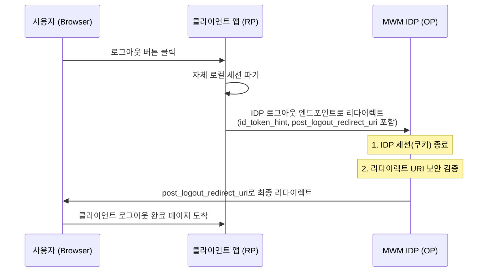

# HOWTO_011: OIDC RP-Initiated Logout 통합 가이드

본 문서는 외부 시스템(OAuth2 Client)이 `mwm-idp`와 연동하여 **표준화된 로그아웃(RP-Initiated Logout)**을 구현하는 방법을 상세히 설명합니다.

---

## 1. 개요 (Overview)

**RP-Initiated Logout**은 클라이언트(RP, Relying Party)가 사용자를 IDP의 로그아웃 엔드포인트로 리다이렉트시켜 다음 두 가지를 동시에 수행하는 프로세스입니다.
1.  **IDP 세션 종료**: IDP 서버에 남아있는 사용자의 SSO 세션 쿠키를 무효화합니다.
2.  **클라이언트 복귀**: 로그아웃이 완료된 후 사용자를 다시 클라이언트 앱의 특정 페이지로 안전하게 되돌려보냅니다.

---

## 2. 로그아웃 플로우 (Logout Flow)



---

## 3. 기술 명세 (Technical Specification)

### 엔드포인트 (Endpoint)
Discovery 엔드포인트를 통해 동적으로 획득하는 것을 권장합니다.
*   **Discovery URL**: `https://idp.mwm.local:20443/.well-known/openid-configuration`
*   **Logout 필드명**: `end_session_endpoint`
*   **실제 URL**: `https://idp.mwm.local:20443/logout`

### 요청 파라미터 (Request Parameters)

| 파라미터 | 필수 여부 | 설명 |
| :--- | :--- | :--- |
| **`id_token_hint`** | 권장 | 로그아웃하려는 사용자의 `id_token`입니다. (세션 식별용) |
| **`post_logout_redirect_uri`** | 선택 | 로그아웃 후 사용자를 보낼 URL입니다. **반드시 IDP에 등록된 Redirect URI 중 하나여야 합니다.** |
| **`state`** | 선택 | 리다이렉트 시 클라이언트로 그대로 전달될 상태 값입니다. |

---

## 4. 구현 예시 (Implementation Examples)

### JavaScript (Frontend)
```javascript
function performLogout(idToken) {
    const logoutEndpoint = "https://idp.mwm.local:20443/logout";
    const postLogoutUri = window.location.origin + "/logout-complete";
    const state = "random_state_string";

    const logoutUrl = `${logoutEndpoint}?` + 
        `id_token_hint=${encodeURIComponent(idToken)}&` +
        `post_logout_redirect_uri=${encodeURIComponent(postLogoutUri)}&` +
        `state=${state}`;

    // IDP로 리다이렉트
    window.location.href = logoutUrl;
}
```

### Python (Flask + Authlib)
```python
@app.route('/logout')
def logout():
    # 1. 로컬 세션 삭제
    id_token = session.get('id_token')
    session.clear()

    # 2. IDP 로그아웃 URL 생성
    idp_logout_url = "https://idp.mwm.local:20443/logout"
    params = {
        "id_token_hint": id_token,
        "post_logout_redirect_uri": url_for('logout_complete', _external=True),
        "state": "optional_state"
    }
    
    from urllib.parse import urlencode
    return redirect(f"{idp_logout_url}?{urlencode(params)}")
```

---

## 5. 보안 및 주의 사항

1.  **Redirect URI 등록**: `post_logout_redirect_uri`는 보안을 위해 IDP 관리자 화면에서 해당 클라이언트의 **Redirect URIs** 목록에 미리 등록되어 있어야 합니다. 등록되지 않은 주소로 리다이렉트를 요청하면 무시되고 IDP 홈으로 이동합니다.
2.  **로컬 세션 먼저 삭제**: IDP로 보내기 전에 클라이언트 앱 자체의 세션(쿠키, 로컬스토리지 등)을 먼저 삭제하는 것이 사용자 경험상 좋습니다.
3.  **id_token_hint 활용**: IDP가 현재 어떤 사용자가 로그아웃을 시도하는지 명확히 알 수 있도록 가급적 `id_token`을 함께 전달하십시오.

---

## 6. 트러블슈팅 (Troubleshooting)

*   **리다이렉트가 안 됨**: `post_logout_redirect_uri`가 IDP에 등록된 주소와 **정확히(대소문자, 포트 포함)** 일치하는지 확인하세요.
*   **IDP 세션이 남아있음**: 사용자가 IDP 로그아웃 페이지에 도달하기 전에 브라우저를 닫았거나, 로그아웃 엔드포인트 URL이 잘못되었을 수 있습니다.
