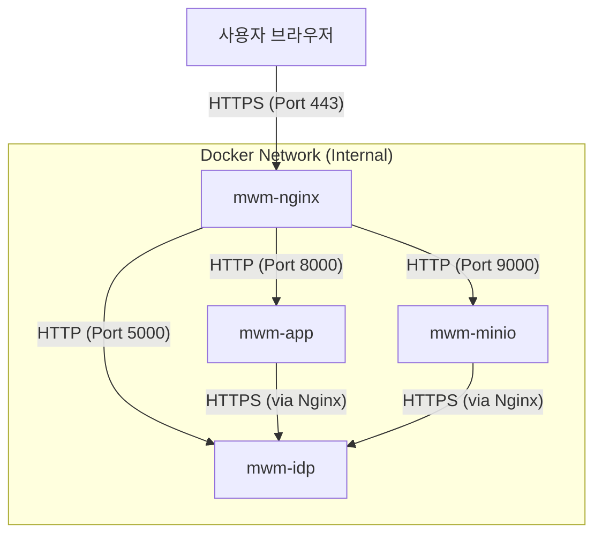

# SPEC_014: MinIO OIDC 연동 설정 및 서버/브라우저 통신 이원화 설계

> **날짜**: 2026-03-28  
> **버전**: `MINIO_OIDC(VER:20260328.002)`  
> **변경 요약**: mwm-idp를 인증 제공자(IdP)로 사용하여 mwm-minio에 OIDC 기반 SSO를 적용한다. 특히 REST API 보안을 위한 API Key 체계와 사용자 동기화를 위한 전용 관리자 콘솔을 구축한다.

---

## 1. 아키텍처 및 통합 URL 설계 (Nginx Proxy 기반)

Nginx를 전면에 배치하여 인증서 관리(SSL Termination)를 전담하고, `mwm-idp`와 `mwm-minio`는 동일한 통합 도메인을 통해 통신한다.

### 1-1. 통신 구조도

### 1-2. 통합 도메인 정의 (예시)
- **Application**: `https://app.mwm.local`
- **IDP 서비스**: `https://idp.mwm.local`
- **MinIO 서비스**: `https://minio.mwm.local`
*(운영 환경에 따라 실제 도메인 또는 IP로 변경 가능)*

---

## 2. MinIO 연동 환경 변수 설정 (`docker-compose.yml`)

Nginx를 통해 통합 URL(HTTPS)을 사용하므로, 번거로운 수동 URL 오버라이드 없이 **Discovery 문서 기반 설정**이 가능해진다.

| 환경 변수명 | 설정값 (예시) | 비고 |
|-----------|-----------|------|
| `MINIO_IDENTITY_OPENID_DISPLAY_NAME` | `MWM Login` | 로그인 버튼명 |
| `MINIO_IDENTITY_OPENID_CONFIG_URL` | `https://idp.mwm.local/.well-known/openid-configuration` | **최우선 설정** |
| `MINIO_IDENTITY_OPENID_CLIENT_ID` | `minio-client` | IDP 등록 ID |
| `MINIO_IDENTITY_OPENID_CLIENT_SECRET` | `minio-secret` | IDP 등록 Secret |
| `MINIO_IDENTITY_OPENID_REDIRECT_URI` | `https://minio.mwm.local/oauth_callback` | 브라우저 리다이렉트 주소 |
| `MINIO_IDENTITY_OPENID_CLAIM_NAME` | `policy` | **(수정)** Role 매핑 클레임 |

### 2-1. 컨테이너 내부의 도메인 해석 (Extra Hosts)
Docker 내부의 MinIO 컨테이너가 `https://idp.mwm.local:20443`으로 접속할 수 있도록 `extra_hosts` 설정을 통해 Nginx IP로 연결해야 한다.

### 2-2. SSL 인증서 신뢰 설정 (Trust Store)
자체 서명 인증서(Self-signed) 환경에서 MinIO가 IDP의 SSL을 신뢰할 수 있도록 인증서를 시스템 보관소에 주입한다.
- **마운트 경로**: `./nginx/certs/mwm_local.crt:/root/.minio/certs/CAs/mwm_local.crt:ro`
- **작동 원리**: MinIO는 기동 시 `${HOME}/.minio/certs/CAs` 내의 모든 인증서를 자동으로 신뢰 목록에 추가한다.
- **장점**: `SKIP_VERIFY` 같은 보안 취약 환경변수 없이도 안전한 통신이 가능하다.

---

## 3. IDP 측 설정 변경 (mwm-idp)

MinIO 연동을 위해 `mwm-idp`에 전용 클라이언트가 등록되어 있어야 한다.

### 3-1. 클라이언트 등록 정보
- **Client ID**: `minio-client`
- **Client Secret**: `minio-secret`
- **Redirect URIs**: `https://minio.mwm.local/oauth_callback`
- **Grant Types**: `authorization_code`
- **Scopes**: `openid profile email groups`

---

    - 사용자는 별도의 MinIO 측 그룹 설정 없이도 IDP 로그인만으로 즉시 관리자(`consoleAdmin`) 권한을 획득한다.

---

## 4. IDP 관리자 콘솔 및 REST API 보안 (mwm-idp)

시스템 자산(User, Client 등)을 보호하기 위해 강력한 보안 계층과 전용 관리 도구를 도입한다.

### 4-1. 관리자 콘솔 (Admin Console)
- **접근 주소**: `https://idp.mwm.local:20443/admin/settings`
- **주요 기능**:
  - **OAuth2 Client 관리**: 연동 중인 외부 앱(MinIO 등)의 정보 수정 및 정책 매핑(Policy Mapping) 설정.
  - **사용자 정보 조회**: 시스템에 등록된 전체 사용자 및 역할(Role) 목록 조회 (Read-only).
  - **데이터베이스 동기화**: `mwm-app` DB의 최신 정보를 수동으로 가져오는 기능 (Sync Now).
  - **준거성 확인**: 각 사용자의 동기화 소스(Sync Source) 및 레포지토리 정보 확인.

### 4-2. REST API 보안 (API Key 체계)
IDP의 관리용 REST API는 일반 세션이 아닌 **API Key(Bearer Token)** 기반의 인증을 강제한다.
- **인증 방식**: `Authorization: Bearer mwm_sk_...` 헤더 사용.
- **키 관리**: 관리자 콘솔에서 개별 관리자별로 키를 발급/조회/갱신(Rotate)할 수 있다.
- **권한 제어**: API Key가 있더라도 실제 사용자의 역할이 `Admin` 또는 `PowerUser`인 경우에만 접근을 허용한다.

---

## 5. 사용자 데이터 동기화 설계 (Sync Workflow)

`mwm-app`(시스템 관리 도구)과 `mwm-idp`(인증 서버) 간의 데이터 일관성을 유지한다.

- **방식**: **Pull 기반 동기화** (IDP가 App의 DB를 직접 조회).
- **대상**: 사용자 계정명, 이메일, 활성화 여부, 권한(Roles).
- **보안**: IDP 서버는 전용 DB URI(`SYNC_MWM_DB_URI`)를 통해 안전하게 `mwm-app` 데이터베이스에 접근한다.
- **자동화**: 관리자 콘솔의 'Sync' 버튼을 통해 즉시 동기화가 가능하며, REST API 호출을 통한 자동화 스케줄링이 가능하다.

---

## 5. 단계별 적용 계획

### Phase 1: Nginx 프록시 및 SSL 통합 (COMPLETED)
Nginx를 통해 통합 도메인(`*.mwm.local`)과 SSL(HTTPS) 환경을 구축하였습니다.

- **포트**: HTTP(`20080`) -> HTTPS(`20443`) 리다이렉트
- **인증서**: OpenSSL 기반 와일드카드 인증서 (`*.mwm.local`)
- **도메인 구성**:
  - `https://app.mwm.local:20443` (Application)
  - `https://idp.mwm.local:20443` (Identity Provider)
  - `https://minio.mwm.local:20443` (MinIO Console)
  - `https://s3.mwm.local:20443` (S3 API)
- **주요 조치 사항**:
  - `/etc/hosts` 및 컨테이너 내부 `extra_hosts` 도메인 매핑.
  - Flask 앱의 `ProxyFix` 적용 및 `PREFERRED_URL_SCHEME = 'https'` 강제.
  - OIDC Discovery (`/.well-known/openid-configuration`) 활성화.

## Phase 2: MinIO-IDP OIDC 연동 (COMPLETED)
Nginx 프록시 기반의 HTTPS 환경과 IDP의 동적 매핑 로직을 통해 MinIO SSO 연동을 완료하였습니다.

- **클라이언트 등록**: REST API 및 IDP 관리 UI를 통한 `minio-client` 등록 완료.
- **SSL 신뢰**: MinIO 컨테이너에 자체 서명 인증서(`mwm_local.crt`) 마운트 완료.
- **권한 연동**: IDP DB의 `policy_mapping` 설정을 통한 자동 권한 부여 확인.
- **테스크**: `Login with OpenID` 버튼을 통한 SSO 진입 확인.

## Phase 3: REST API 보안 및 관리자 콘솔 구축 (COMPLETED)
관리 기능의 보안과 편의성을 극대화하기 위해 전용 관리자 환경을 구축하였습니다.

- **관리자 콘솔**: `/admin/settings`를 통한 중앙 집중식 관리 환경 제공.
- **API Key 보안**: Bearer 토큰 기반의 REST API 인증 시스템 구축.
- **데이터 동기화**: UI 상의 버튼 및 API를 통한 `mwm-app` 사용자 연동 로직 완성.

---

## 6. 주의 사항

- **포트 충돌**: `localhost` 주소 사용 시, 브라우저가 실행되는 PC의 환경과 컨테이너 포트 매핑이 일치해야 한다.
- **Nginx 프록시**: 향후 도메인 기반으로 운영할 경우, `AUTHORIZE_URL` 등은 공개 도메인으로, `TOKEN_URL` 등은 내부 네트워크 유지 또는 외부 도메인 모두 가능하나 내부 네트워크가 성능상 유리하다.
