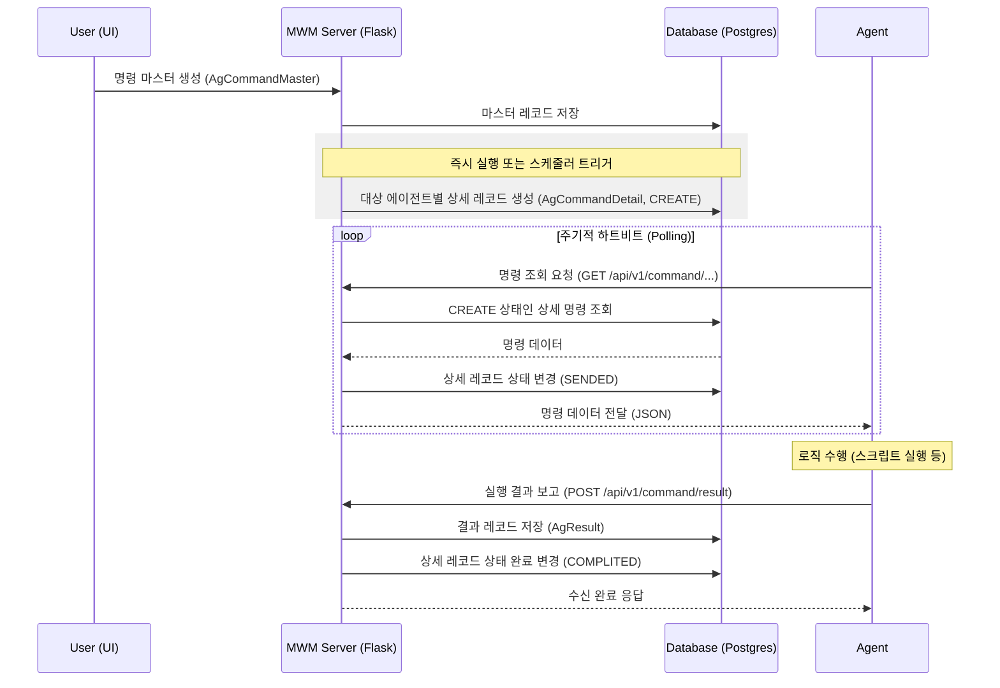

# 에이전트 명령(Command) 시스템 가이드

이 문서는 MWM(Middleware Management) 시스템의 핵심 기능인 에이전트 명령 생성, 배포 및 결과 처리 시스템에 대해 설명합니다.

---

## 1. 개요 (Overview)
중앙 서버에서 수천 대의 원격 서버(에이전트)에 특정 작업(스크립트 실행, 설정 변경, 파일 전송 등)을 지시하고, 그 결과를 실시간으로 수집하여 관리하는 시스템입니다.

---

## 2. 데이터 모델 및 구조 (Data Model)

시스템은 **Master-Detail-Result**의 3단계 구조로 이루어져 있습니다.

### 2.1 AgCommandType (명령 정의)
- 수행할 작업의 '정의'입니다.
- 실행할 파일 경로, 파일명, 명령 클래스(`CommandClass`) 등을 미리 정의합니다.

### 2.2 AgCommandMaster (명령 마스터)
- 누구에게(Target), 언제(Schedule), 무엇을(Type) 시킬지 결정하는 레코드입니다.
- **실행 구분**: `IMMEDIATE`(즉시), `ONETIME`(1회 예약), `PERIODIC`(주기적 반복).
- **대상 지정**: 개별 에이전트, 에이전트 그룹, 또는 **전체 대상(Broadcast)**.

### 2.3 AgCommandDetail (명령 상세)
- 마스터가 생성될 때, 각 에이전트별로 생성되는 실제 수행권입니다.
- `AgResult` 생성을 위한 부모(Parent) 역할을 하며, 데이터 무결성을 보장합니다.
- 상태 변화: `CREATE` → `SENDED` → `COMPLITED` / `FAILED`.

### 2.4 AgResult (실행 결과)
- 에이전트가 명령을 수행한 후 서버로 보내온 결과 데이터입니다.
- 상세 명령(`AgCommandDetail`)과 외래키(FK)로 연결되어 있어, 추적이 가능합니다.

---

## 3. 명령 대상 지정 방식 (Command Targeting)

MWM 시스템은 유연한 대상 지정을 지원하기 위해 세 가지 방식을 제공합니다.

### 3.1 개별 에이전트 (Individual Agents)
- 하나 이상의 특정 에이전트를 직접 선택합니다.
- 특정 장비에만 패치를 적용하거나 개별 상태를 확인해야 할 때 사용합니다.

### 3.2 에이전트 그룹 (Agent Groups)
- 미리 정의된 에이전트 그룹(`AgAgentGroup`)을 선택합니다.
- 운영 장비군, 개발 장비군, 또는 특정 서비스 모듈 단위로 대량의 장비에 동일한 명령을 내릴 때 효율적입니다.

### 3.3 전체 대상 (Broadcast) - [신규]
- 시스템에 승인된 모든 에이전트를 대상으로 합니다.
- **UI**: `전체 대상(Broadcast)`을 `YES`로 선택하면 자동 적용됩니다.
- **지능형 UI 제어**: `YES` 선택 시 '대상 Agent' 및 '그룹' 선택 필드가 자동으로 비활성화(Gray out)되어 중복 선택이나 사용자 실수를 방지합니다.
- **로직**: 명령 저장 또는 스케줄러 실행 시점에 활성 상태인 모든 에이전트를 쿼리하여 개별 실행권을 자동 생성합니다.

---

## 4. 실행 프로세스 (Execution Flow)

1.  **명령 생성 (Server Side)**:
    - 사용자가 UI를 통해 명령 마스터를 생성합니다.
    - 즉시 실행인 경우 `after_insert` 서버 이벤트가 발생하여 상세 레코드를 생성합니다.
    - 주기성 실행인 경우 `APScheduler`가 정해진 시간에 상세 레코드를 생성합니다.

2.  **명령 수신 (Agent Polling)**:
    - 에이전트는 주기적으로 하트비트(REST API)를 서버로 보냅니다.
    - 서버는 해당 에이전트용 `AgCommandDetail` 중 `CREATE` 상태인 항목을 응답으로 내려줍니다.
    - 응답과 동시에 해당 상세 레코드는 `SENDED` 상태로 변경됩니다.

3.  **결과 보고 (Result Submission)**:
    - 에이전트가 작업을 마치면 결과 API(`POST /api/v1/command/result`)를 호출합니다.
    - 서버는 `AgResult`를 생성하고, 연결된 `AgCommandDetail`의 상태를 `COMPLITED` 또는 `FAILED`로 업데이트합니다.

---

## 5. 기술적 특징 및 주의사항

- **무결성 제약**: `AgResult`는 반드시 서버에 미리 생성된 `AgCommandDetail`이 있어야만 저장이 가능합니다. (Foreign Key 제약)
- **주기성 작업**: `PERIODIC` 옵션 사용 시, 매 실행 주기마다 새로운 실행 회차(`repetition_seq`)를 가진 상세 레코드가 생성됩니다.
- **확장성**: 브로드캐스트 기능을 통해 수천 대의 장비에 동시에 자동 업데이트나 환경 설정을 배포할 수 있습니다.
