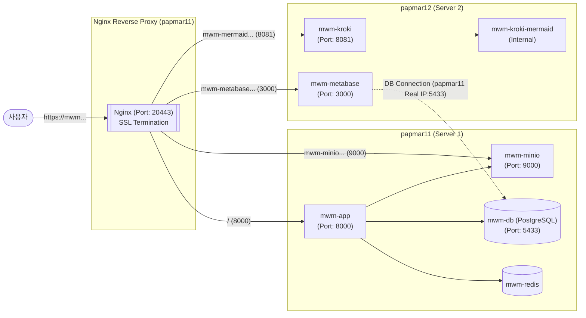

# 리발소(MW App) 현장 구축 및 배포 가이드

본 문서는 리발소(MW App) 시스템을 2대의 Linux 서버(`papmar11`, `papmar12`)에 분산 배치하고, Nginx를 통해 SSL 통신을 처리하는 운영 환경 구축 방안을 정의합니다.

## 1. 시스템 아키텍처 및 서버 구성

시스템의 성능 및 안정성을 확보하기 위해 프론트/핵심 애플리케이션 및 데이터베이스는 1번 서버(`papmar11`)에, 리소스를 많이 소모하는 시각화 및 분석 도구는 2번 서버(`papmar12`)에 분리하여 배치합니다.

### 1-1. 서버별 컴포넌트 배치



| 물리 서버 | 역할 | 도커 컨테이너(서비스) | 포트 | 비고 |
| :--- | :--- | :--- | :--- | :--- |
| **papmar11** | **Web / App / DB** | `nginx` (Host OS 또는 Docker) | 20443 | 리버스 프록시 / SSL Termination |
| (Server 1) | | `mwm-app` | 8000 | 핵심 애플리케이션 |
| | | `mwm-db` | 5433:5432 | PostgreSQL DB |
| | | `mwm-redis` | 6379 | 캐시 처리 / 세션 관리 |
| | | `mwm-minio` | 9000 (API) | S3 호환 오브젝트 스토리지 |

| 물리 서버 | 역할 | 도커 컨테이너(서비스) | 포트 | 비고 |
| :--- | :--- | :--- | :--- | :--- |
| **papmar12** | **모니터링 / 시각화**| `mwm-metabase` | 3000 | BI 및 대시보드 |
| (Server 2) | | `mwm-kroki` | 8081 | 다이어그램 렌더링 서버 |
| | | `mwm-kroki-mermaid` | - | Kroki 플러그인 (내부) |

### 1-2. 서비스 엔드포인트 도메인
Nginx는 `papmar11` 시스템에서 구동되며 20443 포트와 SSL 인증서를 통해 모든 외부 사용자 트래픽을 처리한 뒤 각각의 서비스로 포워딩합니다.

*   **App UI**: `https://mwm.kdb.co.kr:20443`  ->  `http://localhost:8000`
*   **Minio (오브젝트 디렉터리)**: `https://mwm-minio.kdb.co.kr:20443` -> `http://localhost:9000` 
*   **Kroki**: `https://mwm-mermaid.kdb.co.kr:20443`  -> `http://papmar12:8081`
*   **Metabase**: `https://mwm-metabase.kdb.co.kr:20443` -> `http://papmar12:3000`

---

## 2. 서버 간 통신을 위한 Docker Compose 설정 방안

두 대의 서버로 분리됨에 따라 각 서버에서 별도의 `docker-compose.yml`을 유지하거나 통합 관리(Docker Swarm 등)가 필요합니다. 본 가이드는 표준 Docker Compose 구성을 기반으로 설명합니다.

### [papmar11] `docker-compose.yml` (App & DB)
```yaml
services:
  mwm-redis:
    container_name: mwm-redis
    image: redis:alpine
    ...

  mwm-db:
    container_name: mwm-db
    image: postgres:15.2-alpine
    ports:
      - '5433:5432' # 외부(papmar12 Metabase)에서 접근 가능하도록 바인딩 오픈
    ...

  mwm-minio:
    container_name: mwm-minio
    ...

  mwm-app:
    container_name: mwm-app
    depends_on: [mwm-db, mwm-redis, mwm-minio]
    ports:
      - 8000:8000
    environment:
      # AWS_URL 도메인을 Nginx 외부망 주소로 변경 (UI 연동 등 고려)
      AWS_URL: https://mwm-minio.kdb.co.kr:20443
      
      # Kroki 서버 주소 (papmar12의 Nginx URL 또는 내부 IP 사용)
      KROKI_URL: https://mwm-mermaid.kdb.co.kr:20443
    ...
```

### [papmar12] `docker-compose.yml` (시각화 리소스)
> **주의사항:** Metabase는 `papmar11`에 있는 `mwm-db`로 접근해야 하므로, 환경변수 `MB_DB_HOST`를 `papmar11`의 IP로 설정합니다.

```yaml
services:
  mwm-kroki:
    container_name: mwm-kroki
    image: yuzutech/kroki:latest
    environment:
      - KROKI_MERMAID_HOST=mwm-kroki-mermaid
    ports:
      - "8081:8000"

  mwm-kroki-mermaid:
    container_name: mwm-kroki-mermaid
    image: yuzutech/kroki-mermaid:latest

  mwm-metabase:
    container_name: mwm-metabase
    image: metabase/metabase:latest
    ports:
      - "3000:3000"
    environment:
      - MB_DB_TYPE=postgres
      - MB_DB_DBNAME=metabase     # (주의) 사전에 papmar11 db에 생성되어 있어야 함
      - MB_DB_PORT=5433           # papmar11에 노출된 DB 포트 사용
      - MB_DB_USER=tiffanie
      - MB_DB_PASS=1q2w3e4r!!
      - MB_DB_HOST=<papmar11의_Real_IP>  # mwm-db는 Nginx에 등록하지 않고, papmar11의 실제 IP(Real IP)로 직접 접근
      - TZ=Asia/Seoul
```

---

## 3. Nginx 역방향 프록시 (Reverse Proxy) 구성

`papmar11` 서버의 Nginx에서 SSL을 적용(Termination)한 후 HTTP 기반으로 다른 서버(`localhost` 또는 `papmar12`)에 네트워크 트래픽을 분배합니다. 

`nginx.conf` 또는 `conf.d/mwm.conf` 설정 예시입니다.

```nginx
# https://mwm.kdb.co.kr:20443
server {
    listen 20443 ssl;
    server_name mwm.kdb.co.kr;

    ssl_certificate /path/to/mwm.kdb.co.kr.crt;
    ssl_certificate_key /path/to/mwm.kdb.co.kr.key;
    # SSL 추가 설정 ...

    location / {
        proxy_pass http://127.0.0.1:8000;
        proxy_set_header Host $host;
        proxy_set_header X-Real-IP $remote_addr;
        proxy_set_header X-Forwarded-For $proxy_add_x_forwarded_for;
        proxy_set_header X-Forwarded-Proto $scheme;
    }
}

# https://mwm-minio.kdb.co.kr:20443
server {
    listen 20443 ssl;
    server_name mwm-minio.kdb.co.kr;

    ssl_certificate /path/to/mwm.kdb.co.kr.crt; # 와일드카드 또는 개별 인증서
    ssl_certificate_key /path/to/mwm.kdb.co.kr.key;

    location / {
        proxy_pass http://127.0.0.1:9000;
        proxy_set_header Host $host;
        # S3 프로토콜 등의 이슈 방지를 위해 대용량 파일 전송 허용
        client_max_body_size 1G; 
    }
}

# https://mwm-mermaid.kdb.co.kr:20443
server {
    listen 20443 ssl;
    server_name mwm-mermaid.kdb.co.kr;

    ssl_certificate /path/to/mwm.kdb.co.kr.crt;
    ssl_certificate_key /path/to/mwm.kdb.co.kr.key;

    location / {
        # papmar12의 Kroki 서버(8081)로 릴레이
        proxy_pass http://<papmar12의_IP>:8081;
        proxy_set_header Host $host;
    }
}

# https://mwm-metabase.kdb.co.kr:20443
server {
    listen 20443 ssl;
    server_name mwm-metabase.kdb.co.kr;

    ssl_certificate /path/to/mwm.kdb.co.kr.crt;
    ssl_certificate_key /path/to/mwm.kdb.co.kr.key;

    location / {
        # papmar12의 Metabase 서버(3000)로 릴레이
        proxy_pass http://<papmar12의_IP>:3000;
        proxy_set_header Host $host;
    }
}
```

## 4. 방화벽 및 접근 제어 요건
분산 아키텍처이므로 각 서버 간 내부 통신 포트 오픈이 필요합니다. (주의: `mwm-db`는 Nginx 프록시에 등록되지 않으며 실 IP를 통해 직접 통신합니다.)
- `papmar12` -> `papmar11` : **5433 포트(PostgreSQL DB 커넥션, Real IP 사용)**
- `papmar11` -> `papmar12` : **8081 포트(Kroki)**, **3000 포트(Metabase)**
- 사용자망 -> `papmar11` : **20443 포트(Nginx 서비스 포트)**

## 5. 배포 절차 요약
1. `papmar11`, `papmar12` 양쪽 서버에 Docker 및 Docker-Compose 설치
2. 소스 코드 동기화 및 각 서버별 `docker-compose.yml` 분할 적용
3. `papmar11` 데이터베이스 기동 후, `papmar12` 쪽 Metabase 등 부가 기능 기동 (DB 접속 확인)
4. `papmar11`에 Nginx 설치 및 도메인 별 라우팅/SSL 인증서 설정
5. 지정된 도메인을 통해 브라우저 접속 테스트 완료
